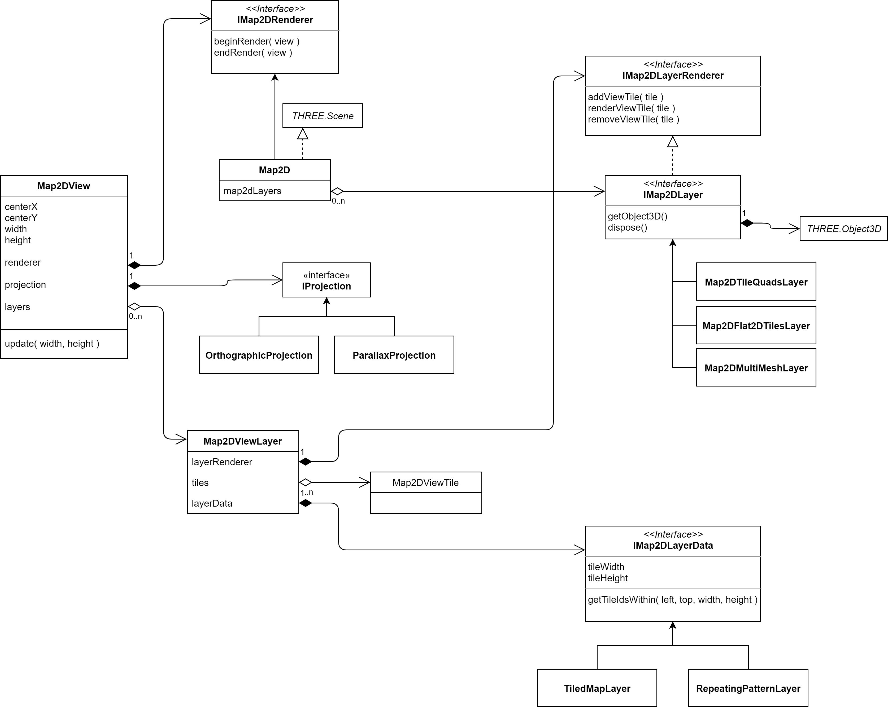

# Map2D

## The Architecture of Map2D

To render a 2d map you need a [Map2D](./Map2D.ts) instance which has a position and can be inserted as `THREE.Object3D` into a `THREE.Scene`, but has no visual representation, instead it serves as _context_ for the _view_ and _data layers_ and the _renderers_.

The [Map2DView](./Map2DView.ts) represents a 2d area of a 2d map (&rarr; Map2D) along the x and y axis and consists of one or more _view layers_ (&rarr; Map2DViewLayer), which are responsible for the rendering.

The [Map2DViewLayer](./Map2DViewLayer.ts) is organized as a grid of tiles (&rarr; Map2DViewTile) similar to a mosaic and is responsible for the lifecycle of the tiles dependent on their visibility which is defined by the _Map2DView&rarr;projection_.

The [Map2DViewTile](./Map2DViewTile.ts) represents an 2d array of _tile ids_. For this purpose it holds a reference to a _data layer_ (&rarr; [IMap2DLayerData](./IMap2DLayerData.ts)). On the other side it is positioned in the grid within the _view layer_ (&rarr; Map2DViewLayer).

The _data layer_ (&rarr; IMap2DLayerData) simply serves as store of the tile ids and defines the general tile properties (width, height, etc.)

### Class Diagram

