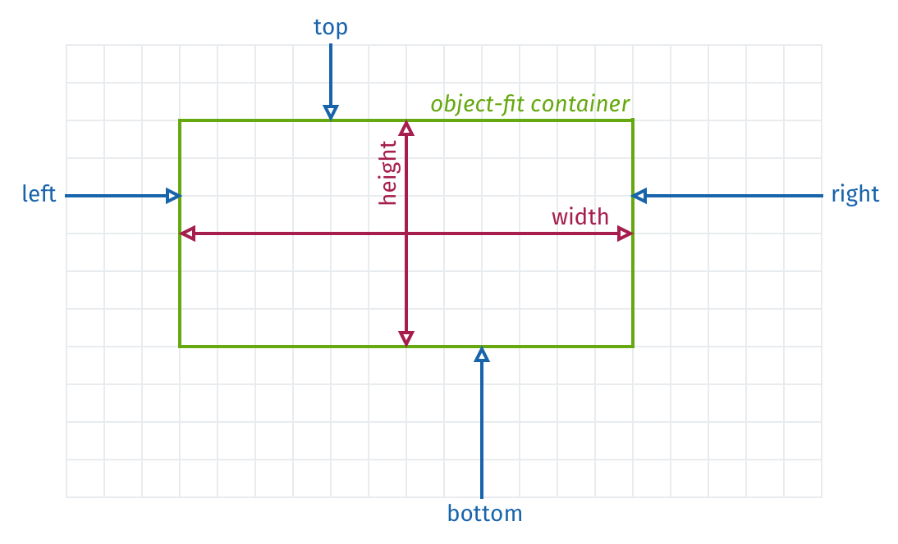

## Description

Defines the *position (x, y, z)* and *size (width, height)* of an image.



A *dynamic* attribute. Is read out every time during the *renderFrame* event.

The `display-position` component is used by the following tags: [`<pi-picture>`](/docs/tags/pi-picture)


## Example

```html
  <pi-picture
    ..
    display-position="top: 10%; bottom: 10%; objectFit: contain"
    ..
    ></pi-picture>
```


## Attributes

| Attribute | Value | Units | Description |
|-----------|-------|-------|-------------|
| **`objectFit`** | `fill` `contain` `cover` | | Specifies how the image should be resized to fit its container box, which is defined by `top`, `left`, `bottom`, `right`, `width` and `height` or the *view* size. *Default value is `fill`* |
| **`width`** | `100vw` | `%` `px` `dpx` `vw` `vh` | Sets the width of the image container |
| **`height`** | `100vh` | `%` `px` `dpx` `vw` `vh` | Sets the height of the image container |
| **`top`** | | `%` `px` `dpx` `vw` `vh` | *Optional.* Sets the top edge of the image container |
| **`right`** | | `%` `px` `dpx` `vw` `vh` | *Optional.* Sets the right edge of the image contianer |
| **`bottom`** | | `%` `px` `dpx` `vw` `vh` | *Optional.* Sets the bottom edge of the image container |
| **`left`** | | `%` `px` `dpx` `vw` `vh` | *Optional.* Sets the left edge of the image container |

